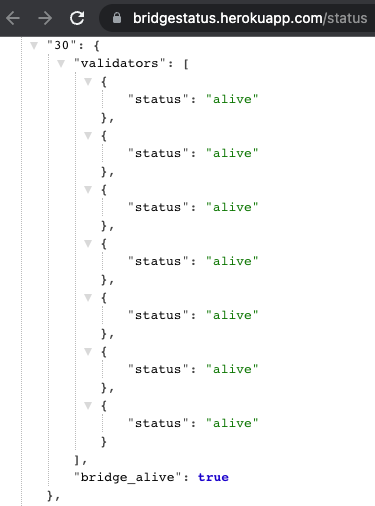
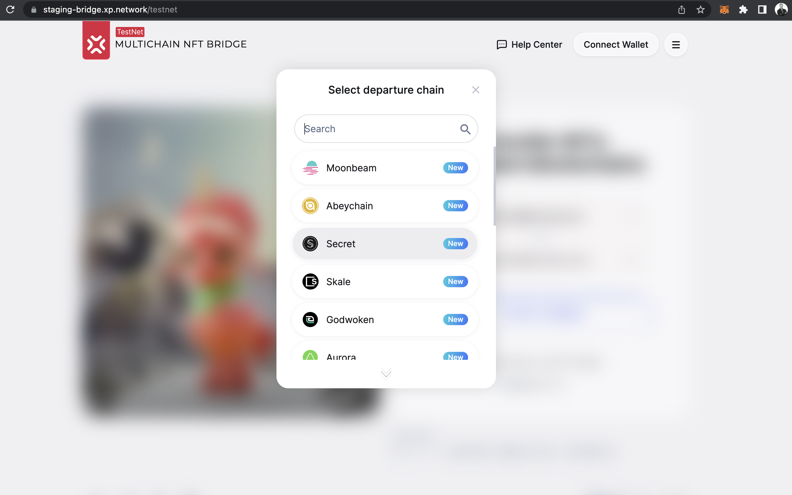
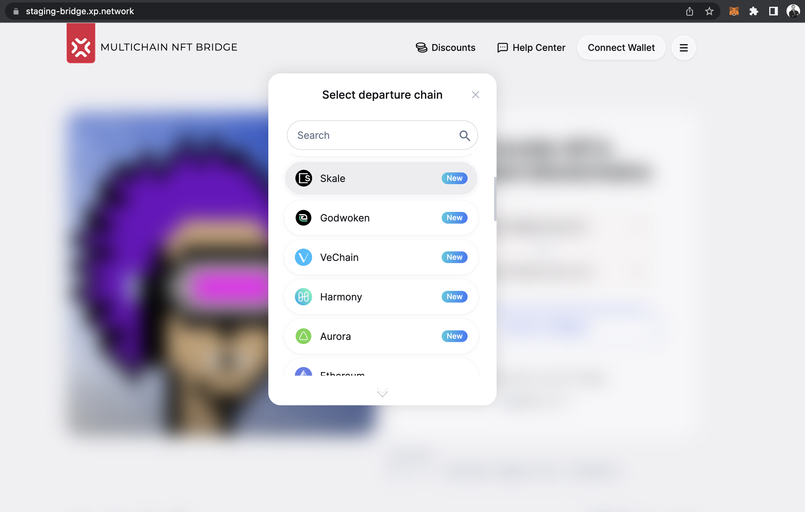

<center>

# Skale-grant-delivery

</center>

## `Milestone 1` — Smart Contract Development

| Specification |
|-|
| 0. Researched about Moonbeam NFT token standards: [ERC-721](https://docs.skale.network/ima/1.3.x/managing-erc721)/[ERC-1155](https://docs.skale.network/ima/1.3.x/managing-erc1155) and other factors & protocols that distinguish it from other chains<br/>We have developed smart contracts that can:<br/>1. Support Singe & Batch transfers - ([ERC-721/ERC-1155](https://github.com/XP-NETWORK/XP.network-HECO-Migration/blob/f474704150da557f931e011026d0c033b391bd7a/dist/Minter.d.ts))<br/>2. [Freeze](https://github.com/XP-NETWORK/XP.network-HECO-Migration/search?q=freeze)/[Unfreeze](https://github.com/XP-NETWORK/XP.network-HECO-Migration/search?q=unfreeze) Native NFTs<br/>3. [Mint](https://github.com/XP-NETWORK/XP.network-HECO-Migration/search?q=mint)/[Burn](https://github.com/XP-NETWORK/XP.network-HECO-Migration/search?q=burn) wrapped NFTs<br/>4. [Withdraw](https://github.com/XP-NETWORK/XP.network-HECO-Migration/search?q=withdraw) the TX fees on the target chain in native tokens<br>5. Trust the [multisig](https://github.com/XP-NETWORK/frost-secp256k1) of the bridge oracle validators<br/>6. [Whitelist](https://github.com/XP-NETWORK/XP.network-HECO-Migration/search?q=whitelist) NFT smart contracts<br/>7. [Pause](https://github.com/XP-NETWORK/XP.network-HECO-Migration/search?q=pause)/[Unpause](https://github.com/XP-NETWORK/XP.network-HECO-Migration/search?q=unpause) for maintenance or if compromised<br/>10. [Add / Remove](https://github.com/XP-NETWORK/XP.network-HECO-Migration/search?q=validate) validator<br/>11. Set consensus [threshold](https://github.com/XP-NETWORK/XP.network-HECO-Migration/search?q=threshold)|

## `Milestone 2` — Integrating into the Live Bridge
| Specification |
|:-|
| 1. Developing validation logic relevant for the Skale part of the bridge<br/>2. Adding Skale to the Bridge [NFT-Indexer](#22-nft-indexing)<br/>3. Integrating TX fee estimation<br/>4. Plugging Skale in the [heartbeat](#24-heartbeat)<br/>5. [Integrating with Skale rpc nodes](#25-integrated-skale-rpc-nodes)<br/>6. Integrating Skale in the [bridge UI](#26-ui-integration)<br/>7. [Deploying smart contracts to the testnet](#27-deployed-contracts-on-the-skale-testnet)<br/>8. [Adding Skale to the bridge JS library](https://github.com/XP-NETWORK/xpjs/search?q=skale)|

## `Milestone 3` — Testing, Fixing Bugs & Documenting

| Specification |
|:-|
| 1. The code contains inline documentation and a [basic tutorial](./js_tutorial.md) that can interact with the deployed smart contracts and backend service.<br/>2. The code has proper unit-test coverage 85% to ensure functionality and robustness. In the guide, we will describe how to run these tests preparing for auditing<br/>3. [Deploying](#27-deployed-contracts-on-the-skale-testnet) and [testing](#33-testnet-transactions) the contracts in the testnet environment|

# LEFT TO DO

## `Milestone 4` — Mainnet Integration & Deployment

| Length | Deliverable | Specification |
|:-:|:-:|-|
| 1 week | Mainnet Integration | 1. Deploying the contracts in the Mainnet environment<br/>2. Integrating the mainnet Wallet<br/>3. Integrating the mainnet NFT-Indexer<br/>4. Integrating the mainnet validators<br/>5. Testing the Integrated Skale in the mainnet<br/>6.Adding Skale to the bridge widget |


# Proofs:

### 2.1 Validation


### 2.2 NFT Indexing

Example testnet Link: https://testnet-notifier.xp.network/testnet-indexer/nfts/30/0x0d7df42014064a163DfDA404253fa9f6883b9187

Request Structure:

```api
GET https://testnet-notifier.xp.network/testnet-indexer/nfts/<chain-nonce>/<user-address>
```

### 2.3 TX Fee estination

Check the [JS tutorial](./js_tutorial.md/#transaction-fee-estimation) of the present delivery report.
### 2.4 Heartbeat

Link: https://bridgestatus.herokuapp.com/status

The internal bridge chain nonce for Skale is 30. Heartbeat checks validator liveliness and responsiveness as well as their funs sufficient for submittingtransactions on the chain. The heartbeat also checks for the chain node or RPC for responsiveness.



### 2.5 Integrated Skale RPC nodes

|Network|RPC URL|Proof|
|:-:|:-:|:-:|
|Testnet|https://staging-v2.skalenodes.com/v1/actual-secret-cebalrai|[Link](https://github.com/XP-NETWORK/xpjs/blob/964e10733e9023ff4ed6f63a1089edc6e22d008e/src/consts.ts#L53)|
|Mainnet|https://mainnet.skalenodes.com/v1/honorable-steel-rasalhague|[Link](https://github.com/XP-NETWORK/xpjs/blob/964e10733e9023ff4ed6f63a1089edc6e22d008e/src/consts.ts#L84)

### 2.6 UI Integration

Testnet UI:
)

Mainnet UI:
)

### 2.7 Deployed contracts on the Skale Testnet

|Contract Name|Contract Address|
|:-:|:-:|
|erc1155_addr| [0xeBCDdF17898bFFE81BCb3182833ba44f4dB25525](https://actual-secret-cebalrai.explorer.staging-v2.skalenodes.com/address/0xeBCDdF17898bFFE81BCb3182833ba44f4dB25525/transactions)|
|erc1155Minter| [0x9cdda01E00A5A425143F952ee894ff99B5F7999F](https://actual-secret-cebalrai.explorer.staging-v2.skalenodes.com/address/0x9cdda01E00A5A425143F952ee894ff99B5F7999F/transactions)|
|UserNftMinter| [0x34933A5958378e7141AA2305Cdb5cDf514896035](https://actual-secret-cebalrai.explorer.staging-v2.skalenodes.com/address/0x34933A5958378e7141AA2305Cdb5cDf514896035/transactions)|
|erc721_addr| [0x8CEe805FE5FA49e81266fcbC27F37D85062c1707](https://actual-secret-cebalrai.explorer.staging-v2.skalenodes.com/address/0x8CEe805FE5FA49e81266fcbC27F37D85062c1707/transactions)|
|minter_addr| [0x3fe9EfFa80625B8167B2F0d8cF5697F61D77e4a2](https://actual-secret-cebalrai.explorer.staging-v2.skalenodes.com/address/0x3fe9EfFa80625B8167B2F0d8cF5697F61D77e4a2/transactions)|


### 3.3 Testnet transactions

Transfer transaction on Skale: https://actual-secret-cebalrai.explorer.staging-v2.skalenodes.com/tx/0xe3d32b6953f1b62ee6ecd09aacf648863cc85499e4b006597ea750e05ae834bc/token-transfers

Wrapped NFT minted on BSC: https://testnet.bscscan.com/tx/0x09eb3c16b49a1fb20857a5f48fc1add289e8a83056be2a08bf8b07e5a0de1c35