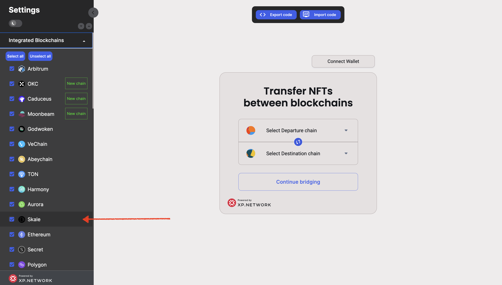

# Milestone 4 proofs

## 1. Deployed the contracts in the Mainnet environment

|Contract Name| Address|Role|
|:-:|:-:|:-:|
|UserNftMinter| 0xC71C2e7b5Ee01f2cb08b41E240976E8Be6012fB0|Minting ERC721 NFTs for testing
|Erc1155Minter| 0xbe6cB5C730C07a788dAB0aD7ed629d9c418a9c14|Minting ERC1155 NFTs for testing
|XPNft1155| 0x783cA58315336dD646aCeCF0b55f728099ee73ec| Default ERC1155 contract
|XPNft| 0xf4C24d031C336CdcC5CC251E5abbE777235A65f3| Default ERC721 contract
|MinterERC20| 0xa8440b0702923A54bb0FF3B55f458Cfe8142C1A0| The Bridge contract

## 2. Integrated the mainnet Wallet

## 3. Integrated the mainnet NFT-Indexer

NFT Indexing in the UI:

NFT Indexing via the API:
https://nft-index.xp.network/index/nfts/30/0x6449b68cc5675f6011e8db681b142773a3157cb9

## 4. Integrating the mainnet validators

The best prove that the validators work properly are the successful transactions:

## 5. Tested the Integrated Skale in the mainnet

Mainnet transactions:

### 5.1. Fantom -> Skale

Departed from Fantom:
https://ftmscan.com/tx/0x960e118b47361465613f048059edc4b3caa341ff468130e7740aef640c113afb

Arrived on Skale:
https://honorable-steel-rasalhague.explorer.mainnet.skalenodes.com/tx/0xf3cd412af133eaa5c22c4e92db388f03e93604d38791266891478fefa7a4d867/token-transfers

### 5.2. Polygon -> Skale

Exited Polygon:
https://polygonscan.com/tx/0x1a0b8889fe6b7bc21ce3362493d229722518033b6e3b2127ad08575b5004d245

Arrived on Skale:
https://honorable-steel-rasalhague.explorer.mainnet.skalenodes.com/tx/0x31125547c7428f6b0107d38dd7e65c5796bf6d60f95ffdebf7b5bf8e8ee17008/token-transfers

### 5.3. Polygon -> Skale

Departed from Polygon:
https://polygonscan.com/tx/0x0767437f6bd822ff27c286a7ab264a5a8814ecf877fbee3e53bf7ae1e9af653b

Arrived on Skale:
https://honorable-steel-rasalhague.explorer.mainnet.skalenodes.com/tx/0xe7999c23ce247b07dc199d3c81d937909985ec6ed23b139b5798a0f68c1a13ab/token-transfers

## 6. Added Skale to the bridge widget

https://widget-staging.xp.network/connect?widget=true&wsettings=true

