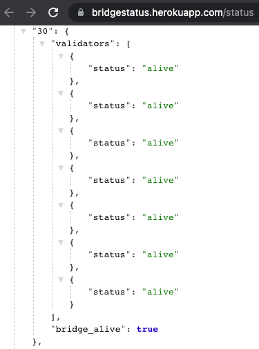
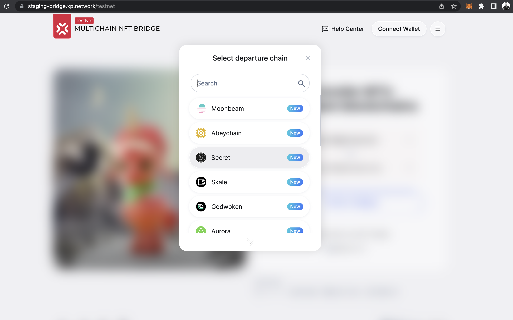

# Proofs:

### 2.1 Validation


### 2.2 NFT Indexing

Example testnet Link: https://testnet-notifier.xp.network/testnet-indexer/nfts/30/0x0d7df42014064a163DfDA404253fa9f6883b9187

Request Structure:

```api
GET https://testnet-notifier.xp.network/testnet-indexer/nfts/<chain-nonce>/<user-address>
```

NFT Indexing in the bridge UI:


### 2.3 TX Fee estimation

Check the [JS tutorial](./js_tutorial.md/#transaction-fee-estimation) of the present delivery report.

TX fee estimation in the bridge UI:


### 2.4 Heartbeat

Link: https://bridgestatus.herokuapp.com/status

The internal bridge chain nonce for Skale is 30. Heartbeat checks validator liveliness and responsiveness as well as their funs sufficient for submittingtransactions on the chain. The heartbeat also checks for the chain node or RPC for responsiveness.



### 2.5 Integrated Skale RPC nodes

|Network|RPC URL|Proof|
|:-:|:-:|:-:|
|Testnet|https://staging-v2.skalenodes.com/v1/actual-secret-cebalrai|[Link](https://github.com/XP-NETWORK/xpjs/blob/964e10733e9023ff4ed6f63a1089edc6e22d008e/src/consts.ts#L53)|
|Mainnet|https://mainnet.skalenodes.com/v1/honorable-steel-rasalhague|[Link](https://github.com/XP-NETWORK/xpjs/blob/964e10733e9023ff4ed6f63a1089edc6e22d008e/src/consts.ts#L84)

### 2.6 UI Integration

Testnet UI:
)

Mainnet UI:
)

### 2.7 Deployed contracts on the Skale Testnet

|Contract Name|Contract Address|
|:-:|:-:|
|erc1155_addr| [0xeBCDdF17898bFFE81BCb3182833ba44f4dB25525](https://actual-secret-cebalrai.explorer.staging-v2.skalenodes.com/address/0xeBCDdF17898bFFE81BCb3182833ba44f4dB25525/transactions)|
|erc1155Minter| [0x9cdda01E00A5A425143F952ee894ff99B5F7999F](https://actual-secret-cebalrai.explorer.staging-v2.skalenodes.com/address/0x9cdda01E00A5A425143F952ee894ff99B5F7999F/transactions)|
|UserNftMinter| [0x34933A5958378e7141AA2305Cdb5cDf514896035](https://actual-secret-cebalrai.explorer.staging-v2.skalenodes.com/address/0x34933A5958378e7141AA2305Cdb5cDf514896035/transactions)|
|erc721_addr| [0x8CEe805FE5FA49e81266fcbC27F37D85062c1707](https://actual-secret-cebalrai.explorer.staging-v2.skalenodes.com/address/0x8CEe805FE5FA49e81266fcbC27F37D85062c1707/transactions)|
|minter_addr| [0x3fe9EfFa80625B8167B2F0d8cF5697F61D77e4a2](https://actual-secret-cebalrai.explorer.staging-v2.skalenodes.com/address/0x3fe9EfFa80625B8167B2F0d8cF5697F61D77e4a2/transactions)|


### 3.3 Testnet transactions

Transfer transaction on Skale: https://actual-secret-cebalrai.explorer.staging-v2.skalenodes.com/tx/0xe3d32b6953f1b62ee6ecd09aacf648863cc85499e4b006597ea750e05ae834bc/token-transfers

Wrapped NFT minted on BSC: https://testnet.bscscan.com/tx/0x09eb3c16b49a1fb20857a5f48fc1add289e8a83056be2a08bf8b07e5a0de1c35